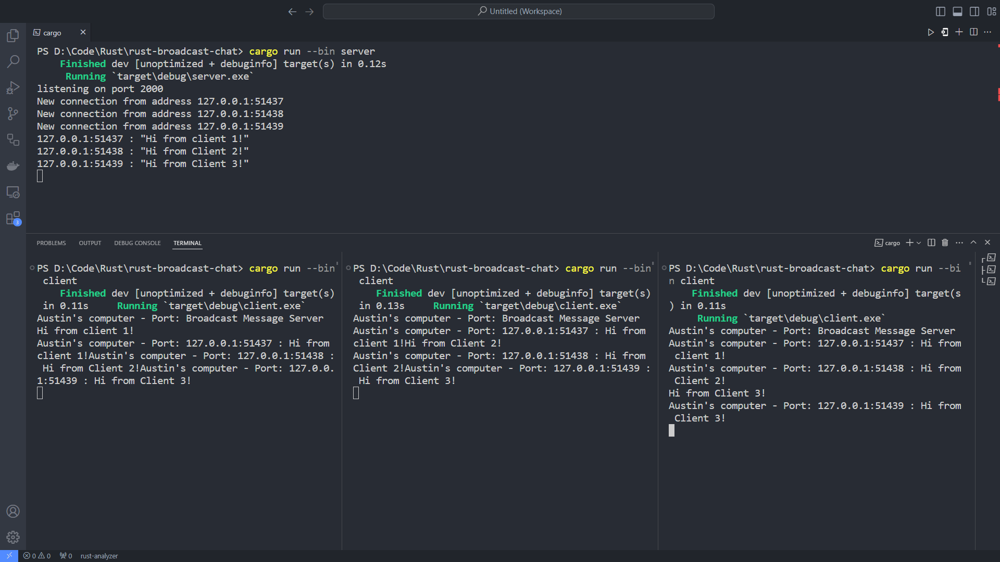

# Reflection

## 2.1. Original code of broadcast chat.

In this test, we can see the original server and client program. The server program is run first and the client program is run afterwards. Everytime a new client connects to the server, the server will show a new connection message. The client also has the ability to type a message. The message the will be sent to the server and the server forwards it to the other clients.
